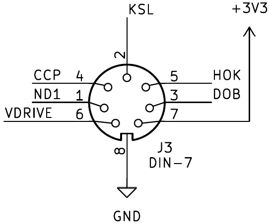

# Ctrl+Knit

Ctrl+Knit is a controller for the Silver Reed SK840 knitting machine. I used this [service manual](https://mkmanuals.com/electrinic-knitting-machine-service-manual.html), my reverse engineering skills and my fiancé's oscilloscope. I tried to replicate the behavior of the EC1 pattern controller and add the options it had.

I used the ESP32-S3-DevKitC-1 development board. According to the manual, the carriage signals are 5V, but it turned out that the sensor outputs are all open-drain, and the signal sent to the carriage works well with 3.3V. So no level shifter is needed.

The patterns are stored on an SD card as PNG files. This has the advantage of visual editing and easy transfer from computer. FAT16, FAT32 and exFAT file systems are supported.

The UI consists of 3 buttons, an EC11 encoder and a large, 3.5 inch [LCD display](https://www.aliexpress.com/item/1005006982336562.html).

The project is under development, new features (Wi-Fi) will be added.

## Usage

First, the content of the SD card is read and the PNG files are displayed.  
Use the menu button for options. You can navigate and toggle the settings with the encoder. Press the menu button again to return to the file listing.  
Use the encoder to navigate to the desired file and select it.  
The picture is displayed along with the filename, width and height.  

### Before pattern knitting

Place the point cams and needle-1 cam on the machine. Power up the controller and connect it to the carriage. Knit two rows or move the carriage across the needles in not knitting mode.

Before connecting the controller to the machine, make sure that the carriage is not between the two point cams (used to signal the pattern start and end).

To start pattern knitting, press the knit button.

### Important

Note that the _invert_ option works the _opposite way_ as the original controller! So when knitting fair isle and invert is off, the white means the contrast yarn and black means the main yarn. When knitting a single motif, I recommend turning the invert on and single motif on and putting the point cams on the side of the knitting (not the pattern).

### While knitting

If you want to change the width of the pattern, you can move the point cam that is on the opposite side of the carriage.

## Wiring

The knitting machine has four output signals and one input signal.

* CCP: Carriage clock pulse. Needle detection. Signals the next needle as the carriage moves across the needle bed.
* ND1: Needle-1 cam detection. Sets the first needle of the pattern. Active-low.
* KSL: Point cam detection. Sets the start and end of the pattern knitting. Passing one cam, the voltage level is switched. Low when the carriage is outside of the pattern knitting.
* HOK: Carriage direction. Whether the carriage moves to the right or to the left. Left is low.
* DOB: Data output buffer. The carriage uses this signal to select the needles.

The knitting machine has a 7-pin DIN (DIN 45329) connector. The following picture shows the wiring of the **socket**, looking at it from the **front**. **Do not power the 16 V unless you are absolutely sure!** You may damage the carriage.

Pin 6 is the 16V input that drives the solenoids. I recommend trying it first with 5V. The needles are selected even with that voltage if there's no actual knitting on the needles.

### Powering the solenoids

The carriage can **overheat** when 16V is given for a long time. To prevent that, a driver circuit is needed. I used a BC847 transistor and an SUP65P06-20 MOSFET. I connected it to the DOB signal.

### Connections

The buttons, encoder signals and the knitting machine's ND1, KSL, HOK, CCP outputs need **pull-up resistors**, as the ESP32 doesn't have internal pull-ups.

I used an LCD screen with 320x480 resolution, and ST7796S driver chip.

| ESP32 pin | Description |
| --------- | ----------- |
| IO01      | Encoder A   |
| IO02      | Encoder B   |
| IO21      | Encoder SW  |
| IO38      | Knit SW     |
| IO37      | Menu SW     |
| IO36      | Back SW     |
| IO04      | ND1         |
| IO05      | KSL         |
| IO06      | DOB         |
| IO07      | HOK         |
| IO08      | CCP         |
| IO48      | LED         |
| IO35      | Buzzer      |
| IO09      | LCD RST     |
| IO10      | LCD CS      |
| IO12      | LCD SCK     |
| IO11      | LCD SDA     |
| IO46      | LCD DC      |
| IO16      | SD MOSI     |
| IO17      | SD MISO     |
| IO15      | SD SS       |
| IO14      | SD SCK      |

And here is a picture of the board.

